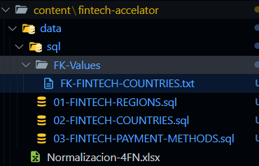
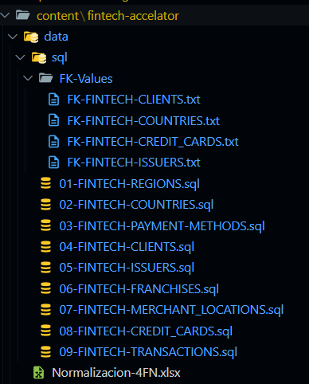

# Pipeline para Generar Datos Ficticios para Sistema Fintech

Este script de Python automatiza la generación de datos ficticios (fake data) para poblar las tablas de un sistema fintech de tarjetas de crédito. Es especialmente útil para crear rápidamente un conjunto de datos de prueba que simule un entorno real.

## Requisitos

- Python 3.6 o superior
- Entorno virtual activado
- Bibliotecas requeridas:
  - `faker` - Para generar datos aleatorios realistas
  - `tqdm` - Para mostrar barras de progreso
  - `psycopg2` - Para conexión con PostgreSQL (si los scripts insertan datos directamente)
- Crear el folder principal `data` en `fintech-accelator` luego crear por dentro los siguientes folders
  - `sql` y por dentro de este `FK-Values`
  - Adicional, es importante contar ya con los archivos `01-FINTECH-REGIONS.sql` , `02-FINTECH-COUNTRIES.sql`, `03-FINTECH-PAYMENT-METHODS.sql` y `FK-Values/FK-FINTECH-COUNTRIES.txt` los cuales ya se encuentran precargados en este repositorio.
  

## Instalación

1. Asegúrate de tener Python instalado en tu sistema.
2. Crea y activa un entorno virtual:

    ```bash
    # Crear entorno virtual
    python -m venv venv

    # Activar en Windows
    .\venv\Scripts\activate

    # Activar en Linux/Mac
    source venv/bin/activate
    ```

3. Instala las dependencias:

    ```bash
    pip install faker tqdm psycopg2-binary
    ```

## Estructura de Archivos

El pipeline ejecuta secuencialmente los siguientes scripts para generar datos ficticios:

1. `clients_fake_fintech.py` - Genera datos de clientes
2. `issuers_fake_fintech.py` - Genera emisores de tarjetas
3. `franchises_fake_fintech.py` - Genera franquicias de tarjetas
4. `merchant_locations_fake_fintech.py` - Genera ubicaciones de comercios
5. `credit_cards_fake_fintech.py` - Genera tarjetas de crédito
6. `transactions_fake_fintech.py` - Genera transacciones para las tarjetas

- Los scripts **deben ejecutarse** orden mostrado, asegurando que las dependencias entre tablas sean respetadas.

## 🔄 Ejecución del Pipeline

Para ejecutar el pipeline completo y generar datos para todas las tablas:

1. Navega hasta la ruta donde tienes el script principal, la cual es `pipelines/pipeline-create-fake-data/`.
2. Activa el entorno virtual:
   ```bash
   .\venv\Scripts\activate
   ```
3. Ejecuta el script principal con los parámetros deseados (por default puedes probar con esta configuración):
   ```bash
   python data_pipeline_auto.py --records 100 --variability 0.25 --start_prefix 4
   ```

### Parámetros Disponibles

El script principal acepta los siguientes parámetros:

- `--records`: Número de registros a generar por cada tabla (predeterminado: 10)
- `--variability`: Factor de variabilidad de datos (0-1), donde valores mayores aumentan la diversidad de datos (predeterminado: 0.25)
- `--start_prefix`: Número inicial para la secuencia de prefijos de archivos (predeterminado: 3)

### Ejemplo de Uso

- Para generar 1000 registros con alta variabilidad:

    ```bash
    python data_pipeline_auto.py --records 1000 --variability 0.8 --start_prefix 4
    ```
    **Console Output**
    ```shell
    2025-05-02 11:41:47 - script_runner - INFO - Starting execution of 6 scripts
    2025-05-02 11:41:47 - script_runner - INFO - Parameters - records: 1000, variability: 0.8, start_prefix: 4
    Processing scripts:   0%|                                                                                                                                                                                                                    | 0/6 [00:00<?, ?it/s]2025-05-02 11:41:47 - script_runner - INFO - Executing script: clients_fake_fintech.py
    2025-05-02 11:41:47 - script_runner - INFO - Using prefix: 04
    Using 23 locales: ro_RO, en_CA, en_US, sl_SI, fr_CA, fr_FR, sk_SK, es_ES, lv_LV, da_DK, en_AU, sv_SE, en_GB, et_EE, tr_TR, no_NO, nl_NL, hr_HR, it_IT, pl_PL, pt_PT, es_MX, es_AR
    Exported 1000 records to C:\Users\study_2025\Documents\Github\Doc-UP-AlejandroJaimes\sql-101-mastering\content\fintech-accelator\data\sql\04-FINTECH-CLIENTS.sql
    ✅ Successfully exported 1000 foreign keys to:
    C:\Users\study_2025\Documents\Github\Doc-UP-AlejandroJaimes\sql-101-mastering\content\fintech-accelator\data\sql\FK-Values\FK-FINTECH-CLIENTS.txt
    2025-05-02 11:41:49 - script_runner - INFO - Successfully executed: clients_fake_fintech.py
    2025-05-02 11:41:49 - script_runner - INFO - Execution time: 2.37s
    Processing scripts:  17%|██████████████████████████████████                                                                                                                                                                          | 1/6 [00:02<00:11,  2.37s/it]2025-05-02 11:41:50 - script_runner - INFO - Executing script: issuers_fake_fintech.py
    2025-05-02 11:41:50 - script_runner - INFO - Using prefix: 05
    Using 23 locales: ro_RO, en_CA, en_US, sl_SI, fr_CA, fr_FR, sk_SK, es_ES, lv_LV, da_DK, en_AU, sv_SE, en_GB, et_EE, tr_TR, no_NO, nl_NL, hr_HR, it_IT, pl_PL, pt_PT, es_MX, es_AR
    Exported 1000 records to C:\Users\study_2025\Documents\Github\Doc-UP-AlejandroJaimes\sql-101-mastering\content\fintech-accelator\data\sql\05-FINTECH-ISSUERS.sql
    ✅ Successfully exported 1000 foreign keys to:
    C:\Users\study_2025\Documents\Github\Doc-UP-AlejandroJaimes\sql-101-mastering\content\fintech-accelator\data\sql\FK-Values\FK-FINTECH-ISSUERS.txt
    2025-05-02 11:41:52 - script_runner - INFO - Successfully executed: issuers_fake_fintech.py
    2025-05-02 11:41:52 - script_runner - INFO - Execution time: 2.06s
    Processing scripts:  33%|████████████████████████████████████████████████████████████████████                                                                                                                                        | 2/6 [00:05<00:11,  2.78s/it]2025-05-02 11:41:53 - script_runner - INFO - Executing script: franchises_fake_fintech.py
    2025-05-02 11:41:53 - script_runner - INFO - Using prefix: 06
    Using 23 locales: ro_RO, en_CA, en_US, sl_SI, fr_CA, fr_FR, sk_SK, es_ES, lv_LV, da_DK, en_AU, sv_SE, en_GB, et_EE, tr_TR, no_NO, nl_NL, hr_HR, it_IT, pl_PL, pt_PT, es_MX, es_AR
    Exported 1000 records to C:\Users\study_2025\Documents\Github\Doc-UP-AlejandroJaimes\sql-101-mastering\content\fintech-accelator\data\sql\06-FINTECH-FRANCHISES.sql
    2025-05-02 11:41:56 - script_runner - INFO - Successfully executed: franchises_fake_fintech.py
    2025-05-02 11:41:56 - script_runner - INFO - Execution time: 2.10s
    Processing scripts:  50%|██████████████████████████████████████████████████████████████████████████████████████████████████████                                                                                                      | 3/6 [00:08<00:08,  2.93s/it]2025-05-02 11:41:57 - script_runner - INFO - Executing script: merchant_locations_fake_fintech.py
    2025-05-02 11:41:57 - script_runner - INFO - Using prefix: 07
    Using 23 locales: ro_RO, en_CA, en_US, sl_SI, fr_CA, fr_FR, sk_SK, es_ES, lv_LV, da_DK, en_AU, sv_SE, en_GB, et_EE, tr_TR, no_NO, nl_NL, hr_HR, it_IT, pl_PL, pt_PT, es_MX, es_AR
    Exported 1000 records to C:\Users\study_2025\Documents\Github\Doc-UP-AlejandroJaimes\sql-101-mastering\content\fintech-accelator\data\sql\07-FINTECH-MERCHANT_LOCATIONS.sql
    2025-05-02 11:41:59 - script_runner - INFO - Successfully executed: merchant_locations_fake_fintech.py
    2025-05-02 11:41:59 - script_runner - INFO - Execution time: 2.06s
    Processing scripts:  67%|████████████████████████████████████████████████████████████████████████████████████████████████████████████████████████████████████████                                                                    | 4/6 [00:11<00:05,  2.98s/it]2025-05-02 11:42:00 - script_runner - INFO - Executing script: credit_cards_fake_fintech.py
    2025-05-02 11:42:00 - script_runner - INFO - Using prefix: 08
    Using 23 locales: ro_RO, en_CA, en_US, sl_SI, fr_CA, fr_FR, sk_SK, es_ES, lv_LV, da_DK, en_AU, sv_SE, en_GB, et_EE, tr_TR, no_NO, nl_NL, hr_HR, it_IT, pl_PL, pt_PT, es_MX, es_AR
    Exported 1000 records to C:\Users\study_2025\Documents\Github\Doc-UP-AlejandroJaimes\sql-101-mastering\content\fintech-accelator\data\sql\08-FINTECH-CREDIT_CARDS.sql
    ✅ Successfully exported 1000 foreign keys to:
    C:\Users\study_2025\Documents\Github\Doc-UP-AlejandroJaimes\sql-101-mastering\content\fintech-accelator\data\sql\FK-Values\FK-FINTECH-CREDIT_CARDS.txt
    2025-05-02 11:42:02 - script_runner - INFO - Successfully executed: credit_cards_fake_fintech.py
    2025-05-02 11:42:02 - script_runner - INFO - Execution time: 2.20s
    Processing scripts:  83%|██████████████████████████████████████████████████████████████████████████████████████████████████████████████████████████████████████████████████████████████████████████                                  | 5/6 [00:14<00:03,  3.06s/it]2025-05-02 11:42:03 - script_runner - INFO - Executing script: transactions_fake_fintech.py
    2025-05-02 11:42:03 - script_runner - INFO - Using prefix: 09
    Using 23 locales: ro_RO, en_CA, en_US, sl_SI, fr_CA, fr_FR, sk_SK, es_ES, lv_LV, da_DK, en_AU, sv_SE, en_GB, et_EE, tr_TR, no_NO, nl_NL, hr_HR, it_IT, pl_PL, pt_PT, es_MX, es_AR
    Exported 1000 records to C:\Users\study_2025\Documents\Github\Doc-UP-AlejandroJaimes\sql-101-mastering\content\fintech-accelator\data\sql\09-FINTECH-TRANSACTIONS.sql
    2025-05-02 11:42:05 - script_runner - INFO - Successfully executed: transactions_fake_fintech.py
    2025-05-02 11:42:05 - script_runner - INFO - Execution time: 2.14s
    Processing scripts: 100%|████████████████████████████████████████████████████████████████████████████████████████████████████████████████████████████████████████████████████████████████████████████████████████████████████████████| 6/6 [00:17<00:00,  2.99s/it]
    2025-05-02 11:42:05 - script_runner - INFO - All scripts executed successfully
    ```

- Para generar pocos registros de prueba con baja variabilidad:

    ```bash
    python data_pipeline_auto.py --records 1000 --variability 0.3 --start_prefix 4
    ```

    **Console Output**
    ```shell
    2025-05-02 11:39:29 - script_runner - INFO - Starting execution of 6 scripts
    2025-05-02 11:39:29 - script_runner - INFO - Parameters - records: 1000, variability: 0.3, start_prefix: 4
    Processing scripts:   0%|                                                                                                                                                                                                                    | 0/6 [00:00<?, ?it/s]2025-05-02 11:39:29 - script_runner - INFO - Executing script: clients_fake_fintech.py
    2025-05-02 11:39:29 - script_runner - INFO - Using prefix: 04
    Using 9 locales: ro_RO, en_CA, en_US, sl_SI, fr_CA, fr_FR, sk_SK, es_ES, lv_LV
    Exported 1000 records to C:\Users\study_2025\Documents\Github\Doc-UP-AlejandroJaimes\sql-101-mastering\content\fintech-accelator\data\sql\04-FINTECH-CLIENTS.sql
    ✅ Successfully exported 1000 foreign keys to:
    C:\Users\study_2025\Documents\Github\Doc-UP-AlejandroJaimes\sql-101-mastering\content\fintech-accelator\data\sql\FK-Values\FK-FINTECH-CLIENTS.txt
    2025-05-02 11:39:30 - script_runner - INFO - Successfully executed: clients_fake_fintech.py
    2025-05-02 11:39:30 - script_runner - INFO - Execution time: 1.23s
    Processing scripts:  17%|██████████████████████████████████                                                                                                                                                                          | 1/6 [00:01<00:06,  1.23s/it]2025-05-02 11:39:31 - script_runner - INFO - Executing script: issuers_fake_fintech.py
    2025-05-02 11:39:31 - script_runner - INFO - Using prefix: 05
    Using 9 locales: ro_RO, en_CA, en_US, sl_SI, fr_CA, fr_FR, sk_SK, es_ES, lv_LV
    Exported 1000 records to C:\Users\study_2025\Documents\Github\Doc-UP-AlejandroJaimes\sql-101-mastering\content\fintech-accelator\data\sql\05-FINTECH-ISSUERS.sql
    ✅ Successfully exported 1000 foreign keys to:
    C:\Users\study_2025\Documents\Github\Doc-UP-AlejandroJaimes\sql-101-mastering\content\fintech-accelator\data\sql\FK-Values\FK-FINTECH-ISSUERS.txt
    2025-05-02 11:39:32 - script_runner - INFO - Successfully executed: issuers_fake_fintech.py
    2025-05-02 11:39:32 - script_runner - INFO - Execution time: 1.09s
    Processing scripts:  33%|████████████████████████████████████████████████████████████████████                                                                                                                                        | 2/6 [00:03<00:06,  1.73s/it]2025-05-02 11:39:33 - script_runner - INFO - Executing script: franchises_fake_fintech.py
    2025-05-02 11:39:33 - script_runner - INFO - Using prefix: 06
    Using 9 locales: ro_RO, en_CA, en_US, sl_SI, fr_CA, fr_FR, sk_SK, es_ES, lv_LV
    Exported 1000 records to C:\Users\study_2025\Documents\Github\Doc-UP-AlejandroJaimes\sql-101-mastering\content\fintech-accelator\data\sql\06-FINTECH-FRANCHISES.sql
    2025-05-02 11:39:34 - script_runner - INFO - Successfully executed: franchises_fake_fintech.py
    2025-05-02 11:39:34 - script_runner - INFO - Execution time: 0.98s
    Processing scripts:  50%|██████████████████████████████████████████████████████████████████████████████████████████████████████                                                                                                      | 3/6 [00:05<00:05,  1.85s/it]2025-05-02 11:39:35 - script_runner - INFO - Executing script: merchant_locations_fake_fintech.py
    2025-05-02 11:39:35 - script_runner - INFO - Using prefix: 07
    Using 9 locales: ro_RO, en_CA, en_US, sl_SI, fr_CA, fr_FR, sk_SK, es_ES, lv_LV
    Exported 1000 records to C:\Users\study_2025\Documents\Github\Doc-UP-AlejandroJaimes\sql-101-mastering\content\fintech-accelator\data\sql\07-FINTECH-MERCHANT_LOCATIONS.sql
    2025-05-02 11:39:36 - script_runner - INFO - Successfully executed: merchant_locations_fake_fintech.py
    2025-05-02 11:39:36 - script_runner - INFO - Execution time: 1.06s
    Processing scripts:  67%|████████████████████████████████████████████████████████████████████████████████████████████████████████████████████████████████████████                                                                    | 4/6 [00:07<00:03,  1.93s/it]2025-05-02 11:39:37 - script_runner - INFO - Executing script: credit_cards_fake_fintech.py
    2025-05-02 11:39:37 - script_runner - INFO - Using prefix: 08
    Using 9 locales: ro_RO, en_CA, en_US, sl_SI, fr_CA, fr_FR, sk_SK, es_ES, lv_LV
    Exported 1000 records to C:\Users\study_2025\Documents\Github\Doc-UP-AlejandroJaimes\sql-101-mastering\content\fintech-accelator\data\sql\08-FINTECH-CREDIT_CARDS.sql
    ✅ Successfully exported 1000 foreign keys to:
    C:\Users\study_2025\Documents\Github\Doc-UP-AlejandroJaimes\sql-101-mastering\content\fintech-accelator\data\sql\FK-Values\FK-FINTECH-CREDIT_CARDS.txt
    2025-05-02 11:39:38 - script_runner - INFO - Successfully executed: credit_cards_fake_fintech.py
    2025-05-02 11:39:38 - script_runner - INFO - Execution time: 1.11s
    Processing scripts:  83%|██████████████████████████████████████████████████████████████████████████████████████████████████████████████████████████████████████████████████████████████████████████                                  | 5/6 [00:09<00:01,  2.00s/it]2025-05-02 11:39:39 - script_runner - INFO - Executing script: transactions_fake_fintech.py
    2025-05-02 11:39:39 - script_runner - INFO - Using prefix: 09
    Using 9 locales: ro_RO, en_CA, en_US, sl_SI, fr_CA, fr_FR, sk_SK, es_ES, lv_LV
    Exported 1000 records to C:\Users\study_2025\Documents\Github\Doc-UP-AlejandroJaimes\sql-101-mastering\content\fintech-accelator\data\sql\09-FINTECH-TRANSACTIONS.sql
    2025-05-02 11:39:40 - script_runner - INFO - Successfully executed: transactions_fake_fintech.py
    2025-05-02 11:39:40 - script_runner - INFO - Execution time: 1.04s
    Processing scripts: 100%|████████████████████████████████████████████████████████████████████████████████████████████████████████████████████████████████████████████████████████████████████████████████████████████████████████████| 6/6 [00:11<00:00,  1.92s/it]
    2025-05-02 11:39:40 - script_runner - INFO - All scripts executed successfully
    ```
    

## Monitoreo y Logs

Durante la ejecución, el script muestra:

- Una barra de progreso que indica el avance general
- Información detallada sobre cada script ejecutado
- Tiempo de ejecución para cada script

Además, todos los logs se guardan en el archivo `script_execution.log` para revisión posterior.

## Estructura Detallada de los Scripts Individuales

Cada script individual (como `clients_fake_fintech.py`) acepta los siguientes parámetros:

- `--records`: Número de registros a generar (obligatorio)
- `--seed`: Semilla aleatoria para resultados reproducibles (predeterminado: 42)
- `--variability`: Variabilidad de datos (0-1) (predeterminado: 0.3)
- `--prefix`: Prefijo para los archivos de salida (predeterminado: 'XX')

### Ejemplo de Ejecución Manual de un Script Individual

Si necesitas ejecutar solo uno de los scripts:

```bash
python .\class\clients_fake_fintech.py --records 100 --variability 0.3 --prefix 03
```

## Notas Importantes

- **Activación del Entorno Virtual**: El script verificará si tienes el entorno virtual activado y mostrará un error si no es así.
- **Orden de Ejecución**: Los scripts se ejecutan en orden secuencial para respetar las dependencias entre tablas.
- **Prefijos de Archivos**: Los prefijos de los archivos de salida se incrementan automáticamente (03, 04, 05, etc.).
- **Comportamiento en Caso de Error**: Si alguno de los scripts falla, el pipeline se detendrá y registrará el error.

## Solución de Problemas

Si encuentras problemas al ejecutar el pipeline:

1. Verifica que tu entorno virtual esté activado
2. Asegúrate de que todas las dependencias estén instaladas
3. Revisa el archivo `script_execution.log` para obtener detalles sobre cualquier error
4. Confirma que la estructura de directorios sea correcta (los scripts deben estar en la carpeta `class/`)