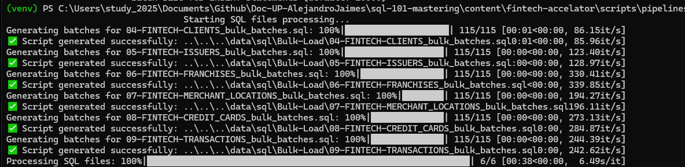
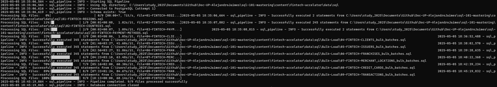

# PostgreSQL SQL Pipeline Executor

Este script automatiza la ejecución de scripts SQL en una base de datos PostgreSQL, diseñado específicamente para poblar la base de datos fintech_cards con datos de prueba de manera eficiente.

## Requisitos Previos

- **Base de datos configurada**: Asegúrate de haber creado la base de datos `fintech_cards` y el esquema `fintech`
- **Datos generados**: Debes haber ejecutado previamente el pipeline de generación de datos ficticios
- **Dependencias**:
  - Python 3.6+
  - psycopg2-binary (para conexión PostgreSQL)
  - tqdm (para barras de progreso)

## Instalación

1. Instala las dependencias necesarias:

```bash
pip install psycopg2-binary tqdm
```

## Flujo de Ejecución

El proceso completo consta de dos pasos:

1. **Conversión a Bulk Inserts**: Primero es necesario convertir los archivos SQL individuales a inserts por lotes
2. **Ejecución del Pipeline**: Luego se ejecuta el pipeline que carga todos los datos en la base de datos

## Paso 1: Conversión a Bulk Inserts

### ¿Por qué usar Bulk Inserts?

Los archivos SQL 04 al 09 contienen miles de declaraciones INSERT individuales, lo que afecta significativamente el rendimiento cuando se ejecutan uno por uno. La conversión a inserts por lotes (bulk inserts) ofrece las siguientes ventajas:

- **Rendimiento**: Mejora dramáticamente la velocidad de inserción (hasta 10x más rápido)
- **Eficiencia de red**: Reduce la sobrecarga de comunicación entre el cliente y el servidor de base de datos
- **Menor sobrecarga de transacciones**: Agrupa múltiples operaciones en una sola transacción
- **Mejor utilización de recursos**: Optimiza el uso de CPU y memoria en el servidor de base de datos

Los archivos 01 al 03 no se convierten porque contienen pocos valores y no hay beneficios significativos al convertirlos a formato bulk.

### Ejecutar la Conversión

```bash
python sql_bulk_insert.py --batch-size 10000
```
**Ejemplo**

```bash
python .\sql_bulk_insert.py --batch-size 10000
```

#### Parámetros Disponibles para Conversión

| Parámetro     | Descripción                                  | Valor por defecto   |
|---------------|---------------------------------------------|---------------------|
| --batch-size  | Número de registros por lote                | 10000               |
| --output-dir  | Directorio de salida personalizado          | ../../../data/sql/Bulk-Load |

#### Ejemplo de Salida de Conversión



```
Starting SQL files processing...
Generating batches for 04-FINTECH-CLIENTS_bulk_batches.sql: 100%|████████████████████| 115/115 [00:01<00:00, 86.15it/s]
✅ Script generated successfully: ..\..\..\data\sql\Bulk-Load\04-FINTECH-CLIENTS_bulk_batches.sql
Generating batches for 05-FINTECH-ISSUERS_bulk_batches.sql: 100%|███████████████████| 115/115 [00:00<00:00, 123.40it/s]
✅ Script generated successfully: ..\..\..\data\sql\Bulk-Load\05-FINTECH-ISSUERS_bulk_batches.sql
Generating batches for 06-FINTECH-FRANCHISES_bulk_batches.sql: 100%|████████████████| 115/115 [00:00<00:00, 330.41it/s]
✅ Script generated successfully: ..\..\..\data\sql\Bulk-Load\06-FINTECH-FRANCHISES_bulk_batches.sql
Generating batches for 07-FINTECH-MERCHANT_LOCATIONS_bulk_batches.sql: 100%|████████| 115/115 [00:00<00:00, 194.27it/s]
✅ Script generated successfully: ..\..\..\data\sql\Bulk-Load\07-FINTECH-MERCHANT_LOCATIONS_bulk_batches.sql
Generating batches for 08-FINTECH-CREDIT_CARDS_bulk_batches.sql: 100%|██████████████| 115/115 [00:00<00:00, 273.13it/s]
✅ Script generated successfully: ..\..\..\data\sql\Bulk-Load\08-FINTECH-CREDIT_CARDS_bulk_batches.sql
Generating batches for 09-FINTECH-TRANSACTIONS_bulk_batches.sql: 100%|██████████████| 115/115 [00:00<00:00, 244.39it/s]
✅ Script generated successfully: ..\..\..\data\sql\Bulk-Load\09-FINTECH-TRANSACTIONS_bulk_batches.sql
Processing SQL files: 100%|██████████████████████████████████████████████████████████████| 6/6 [00:38<00:00, 6.49s/it]
```

### Estructura de Archivos de Salida

El script generará un archivo SQL en la carpeta `Bulk-Load` para cada archivo original, con el siguiente formato:

```sql
BEGIN;
INSERT INTO table_name (column1, column2, ...) VALUES
(value1_1, value1_2, ...),
(value2_1, value2_2, ...),
...
(valueN_1, valueN_2, ...);
COMMIT;
```

## Paso 2: Ejecución del Pipeline

Una vez convertidos los archivos, el siguiente paso es ejecutar el pipeline completo:

```bash
python sql_insert_pipeline_auto.py --user <usuario> --password <contraseña> --db-name fintech_cards --sql-dir ../../../data/sql --delay 1.5
```

**Ejemplo**

```bash
python sql_insert_pipeline_auto.py --user fc_admin --password "mypass" --db-name fintech_cards --sql-dir ../../../data/sql --delay 1.5
```



### Estructura de Archivos SQL

El pipeline ejecutará los siguientes archivos SQL en orden secuencial:

#### Archivos Estándar (carpeta principal):
1. `01-FINTECH-REGIONS.sql`
2. `02-FINTECH-COUNTRIES.sql`
3. `03-FINTECH-PAYMENT-METHODS.sql`

#### Archivos Bulk Insert (subcarpeta Bulk-Load):
4. `04-FINTECH-CLIENTS_bulk_batches.sql`
5. `05-FINTECH-ISSUERS_bulk_batches.sql`
6. `06-FINTECH-FRANCHISES_bulk_batches.sql`
7. `07-FINTECH-MERCHANT_LOCATIONS_bulk_batches.sql`
8. `08-FINTECH-CREDIT_CARDS_bulk_batches.sql`
9. `09-FINTECH-TRANSACTIONS_bulk_batches.sql`

### Parámetros Disponibles para el Pipeline

| Parámetro     | Descripción                                  | Valor por defecto   |
|---------------|---------------------------------------------|---------------------|
| --host        | Host de PostgreSQL                          | localhost           |
| --port        | Puerto de PostgreSQL                        | 5433                |
| --user        | Nombre de usuario (requerido)               | -                   |
| --password    | Contraseña (requerido)                      | -                   |
| --db-name     | Nombre de la base de datos                  | fintech_cards       |
| --schema-name | Nombre del esquema                          | fintech             |
| --sql-dir     | Directorio con archivos SQL                 | . (directorio actual)|
| --max-retries | Intentos máximos de conexión                | 3                   |
| --delay       | Retardo entre archivos (segundos)           | 1.0                 |

## Validación de Datos Insertados

Para verificar que todos los datos se han insertado correctamente, puedes ejecutar la siguiente consulta SQL:

### Conexión a PostgreSQL

```bash
psql -U fc_admin -d fintech_cards -p 5433
```

### Consulta de Validación

```sql
SELECT 'regions' AS table_name, COUNT(*) AS record_count FROM fintech.regions
UNION ALL
SELECT 'countries', COUNT(*) FROM fintech.countries
UNION ALL
SELECT 'payment_methods', COUNT(*) FROM fintech.payment_methods
UNION ALL
SELECT 'clients', COUNT(*) FROM fintech.clients
UNION ALL
SELECT 'issuers', COUNT(*) FROM fintech.issuers
UNION ALL
SELECT 'franchises', COUNT(*) FROM fintech.franchises
UNION ALL
SELECT 'merchant_locations', COUNT(*) FROM fintech.merchant_locations
UNION ALL
SELECT 'credit_cards', COUNT(*) FROM fintech.credit_cards
UNION ALL
SELECT 'transactions', COUNT(*) FROM fintech.transactions
ORDER BY table_name;
```

### Resultado Esperado

```
   table_name      | record_count 
-------------------+--------------
 clients           |      1150000
 countries         |         244
 credit_cards      |      1150000
 franchises        |      1150000
 issuers           |      1150000
 merchant_locations|      1150000
 payment_methods   |           4
 regions           |           9
 transactions      |      1150000
(9 rows)
```

## Características Clave

- **Conversión automática a Bulk Inserts**: Mejora dramáticamente el rendimiento
- **Conexión robusta**: Reintentos automáticos con backoff exponencial
- **Validación de archivos**: Verifica existencia y legibilidad de los scripts SQL
- **Transacciones**: Manejo automático de transacciones por archivo y por lote
- **Progreso visual**: Barras de progreso para cada fase del proceso
- **Manejo de errores**: Detiene la ejecución si falla algún script y hace rollback
- **Logging detallado**: Registro de cada operación para diagnóstico

## Estructura del Proyecto

```
fintech-accelator/
├── data/
│   └── sql/
│       ├── 01-FINTECH-REGIONS.sql
│       ├── 02-FINTECH-COUNTRIES.sql
│       ├── 03-FINTECH-PAYMENT-METHODS.sql
│       ├── 04-FINTECH-CLIENTS.sql
│       ├── ... (otros archivos SQL originales)
│       └── Bulk-Load/
│           ├── 04-FINTECH-CLIENTS_bulk_batches.sql
│           ├── 05-FINTECH-ISSUERS_bulk_batches.sql
│           └── ... (archivos SQL convertidos)
└── pipelines/
    └── insert-data/
        ├── sql_bulk_insert.py
        ├── sql_pipeline.py
        └── README.md
```

## Notas Importantes

1. **Orden de conversión**: Siempre ejecutar primero `sql_bulk_insert.py` antes del pipeline
2. **Orden de ejecución**: Los archivos SQL se ejecutan en el orden numérico especificado
3. **Dependencias**: Cada script depende de los anteriores, no modificar el orden
4. **Esquema**: Asegúrate que el esquema `fintech` exista en la base de datos
5. **Permisos**: El usuario debe tener permisos suficientes en la base de datos
6. **Rendimiento**: El uso de bulk inserts reduce significativamente el tiempo total de ejecución

## Solución de Problemas

Si encuentras errores:

1. Verifica que todos los archivos SQL existan en el directorio especificado
2. Confirma las credenciales de la base de datos
3. Revisa los logs para mensajes de error específicos
4. Asegúrate que el esquema `fintech` exista
5. Si falla la conexión, intenta aumentar `--max-retries`
6. Si hay problemas con la conversión de los archivos, verifica que los archivos originales tengan el formato INSERT correcto